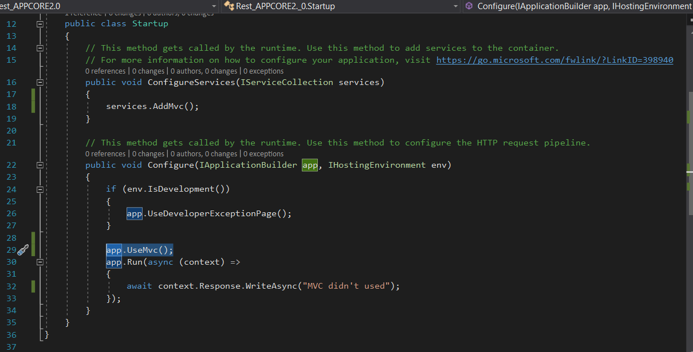

# In the Name of Allah
---

### 1- Creating new Asp.net Core Project using Visual studio 2017
 - open new project ASP.net core from web kit
 - Choose .net core App 2.0 Empty project
 - Now let's browse our project ,, Going to ``` startup.cs ``` it has 2 methods
   - ```
    public void ConfigureServices(IServiceCollection services)
       {

       }
      ```
    This method gets called by the runtime. Use this method to add services to the container.
   -
       ```        public void Configure(IApplicationBuilder app, IHostingEnvironment env)
        {
            if (env.IsDevelopment())
            {
                app.UseDeveloperExceptionPage();
            }


            app.Run(async (context) =>
            {
                await context.Response.WriteAsync("MVC didn't used");
            });
        }

      ```
    This method gets called by the runtime. Use this method to configure the HTTP request pipeline.
 - Now let's try to using our mvc services
  - add mvc service to the **ConfigureServices**  method
   ``` services.AddMvc();

   ```
  - and let's use Mvc in runtime app by adding a code
  ```
  app.UseMvc();

  ```
   -  
